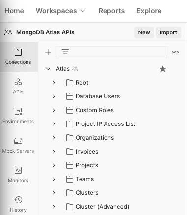
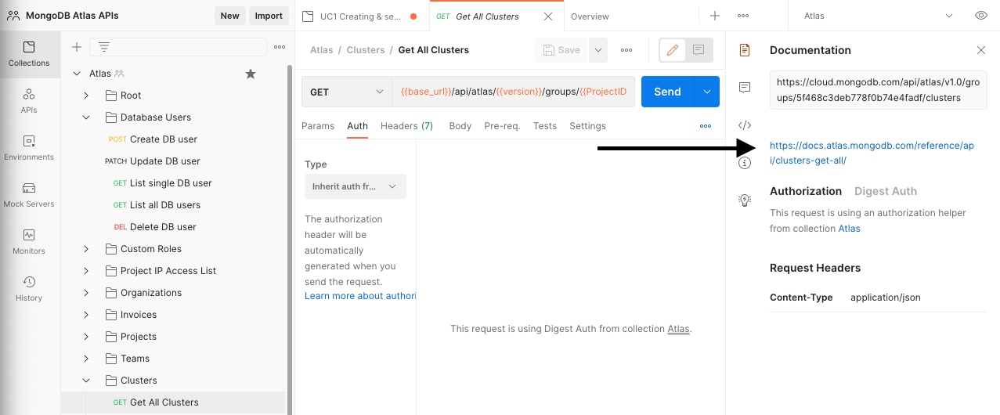

# mongodb-atlas-api-resources
This repo contains a Postman project containing a full set of APIs calls to all resources provided by MongoDB Atlas.

* [MongoDB Atlas API Resources Documentation](https://docs.atlas.mongodb.com/reference/api-resources/) - here you will find the most updated documentation of the the APIs resources.

---
## Description

This is a repo with a Postman collection containing all avaiable API calls (as of August 2021) to help you understand and build automation/integration with MongoDB Atlas.

---
## Setup
__1. Configure Laptop__
* [Download](https://www.postman.com/downloads/) and install Postman on your laptop
* [Training](https://learning.postman.com/) on Postman is available and it has been chosen by its popularity
* [Import](https://learning.postman.com/docs/getting-started/importing-and-exporting-data/#importing-data-into-postman) the *MongoDB-Atlas.postman_collection.json* collection into your Postman workspace
 

__2. Configure MongoDB Atlas__

* Create a free [MongoDB Atlas account](https://account.mongodb.com/account/register)to have access to a free cluster to play around in. Make sure you create an organization and a project. Don't skip that step. Here is a coupon code **GOATLAS10** for some credits to explore more features (valid as of August 2021). Watch this [video] (https://www.youtube.com/watch?v=FxeQ5eck3tw) to learn how to add these credits to your account.
* Create a dedicated [database deployment](https://docs.atlas.mongodb.com/create-database-deployment/#create-a-new-database-deployment) (cluster). Use a M10 tier or higher to have full access to all of the APIs resources*. Feel free to explore all of the other options, but the default options should be fine for this example.
* Create an [API key](https://docs.atlas.mongodb.com/configure-api-access/) with Organization Owner privileges and save the public/private key to use when calling APIs. Also, don't forget to add your laptop/workstation IP to the API access list. 
* Navigate to your Project Settings and retrieve your Project ID so it can be used in one of our examples below. 

__3. Configure and use Postman__
* [Import](https://learning.postman.com/docs/getting-started/importing-and-exporting-data/#importing-data-into-postman) the MongoDB-Atlas.postman_collection.json collection and Atlas.postman_environment.json environment variables found in this repo into your Postman workspace.
* Click on the MongoDB Atlas Collection. Under the Authorization tab, choose the Digest Auth Type and use the public key as the user and the private key as your password.

## Tips

Once you have imported this collection you will notice that we have a folder sturcture following the order showed in the [MongoDB Atlas API Resources Documentation](https://docs.atlas.mongodb.com/reference/api-resources/). Inside the folders you will find all the APIs calls to that specific resource.  Each call will have a sample request, but for more options on the same API call check the documentation. You can find the direct link to the documentation on the documentation section in Postman.

*Folder structure* 

*Documentation link on the documentation section of Postman*

